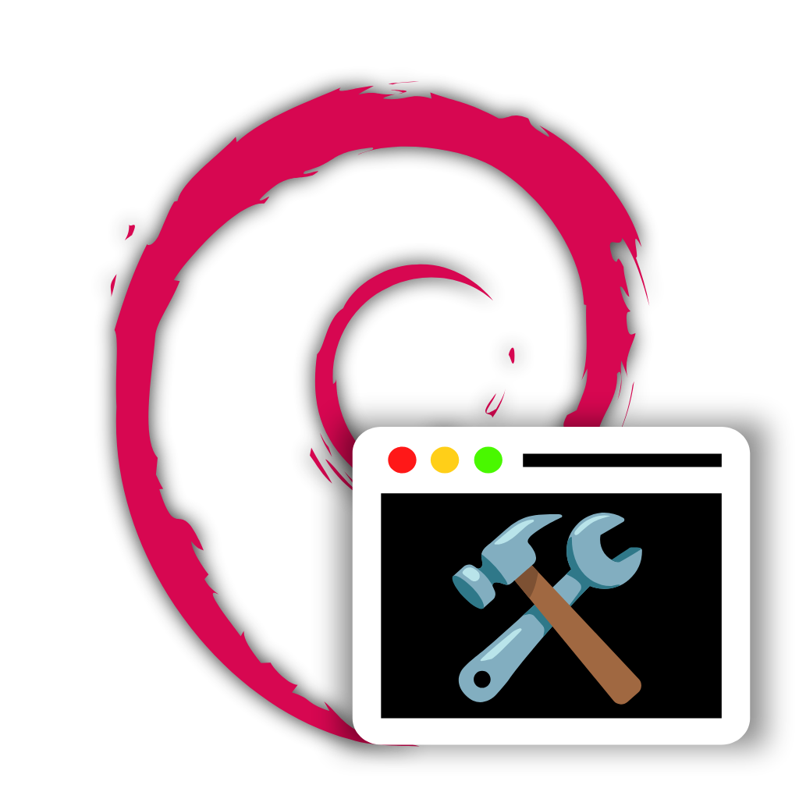
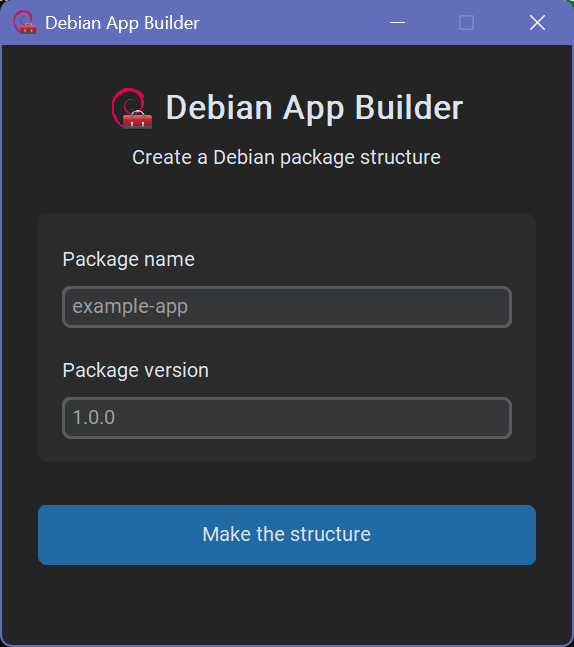
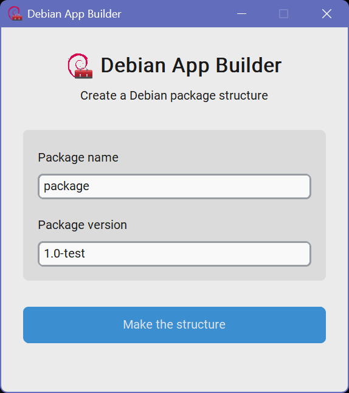
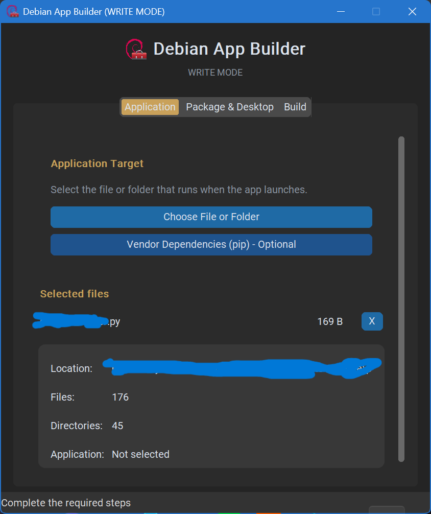
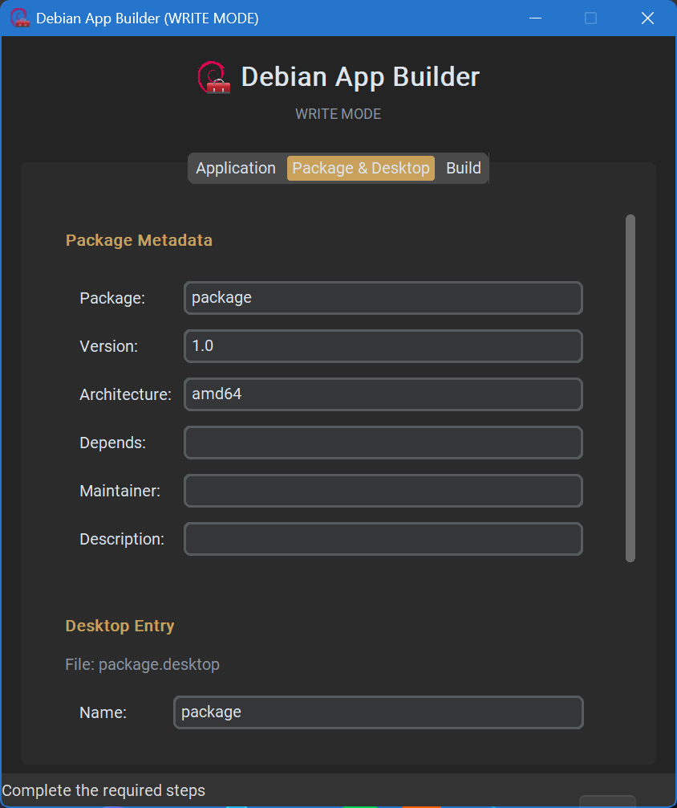
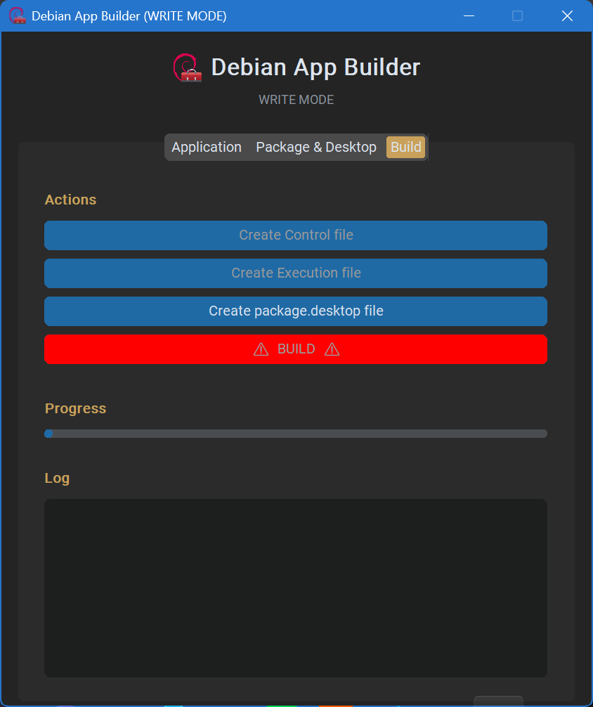

# Debian App Builder

Debian App Builder is a graphical tool for creating Debian (`.deb`) packages from Python applications, C programs, images, or application folders. It creates the package layout, `control` metadata, launcher script, and desktop entry for you.

Package a project in a few guided steps, then build an installable Debian package without hand-writing the package tree.

<p align="center">
	
</p>

## Screenshots

<p align="center">
	
	
	
	
	
</p>

## Features

- Create the standard `DEBIAN`, `usr/bin`, and `usr/share` package directories.
- Select a Python file, C source file, image, or application folder.
- Compile selected C source files with `gcc`.
- Add package name, version, architecture, dependencies, and maintainer metadata.
- Optionally vendor Python dependencies into the package.
- Build the finished package with `dpkg-deb`.

## Requirements

- Python 3.9 or newer
- `customtkinter`
- Debian-based Linux with `dpkg-deb`, or Windows with a Debian/Ubuntu WSL distribution
- `gcc` when packaging a C source file

On Debian-based Linux, install the system tools and Python dependency with:

```bash
sudo apt install dpkg-dev python3-tk
python3 -m pip install --user customtkinter
```

On Windows, run these commands inside a Debian or Ubuntu WSL terminal and use `python` instead of `python3` when necessary.

## Run From Source

Clone the repository and launch the GUI:

```bash
git clone https://github.com/tuffgit21/Debian-App-Builder.git
cd Debian-App-Builder
python3 DebianAppBuilder-source/DebAppBuilder.py
```

On Windows, start the program from a Debian or Ubuntu WSL terminal so that `dpkg-deb` is available.

## Basic Workflow

1. Choose the application file or folder.
2. Enter the package name, version, architecture, dependencies, and maintainer.
3. Review the generated package files.
4. Optionally vendor Python dependencies.
5. Build the `.deb` package from the **Build** tab.

For C applications, Debian App Builder compiles the selected `.c` file with `gcc` before placing it in the package.

The generated package is created in the selected output location and can be installed on a compatible Debian-based system with:

```bash
sudo dpkg -i path/to/package.deb
sudo apt-get install -f
```

## Fun Fact

Debian App Builder packages itself. The tool used to build Debian App Builder is Debian App Builder.

## Source Layout

```text
Debian-App-Builder/
├── DebianAppBuilder-source/
│   ├── DebAppBuilder.py   # GUI entry point
│   └── core.py            # Package generation and dependency vendoring
├── DebAppBuilderLogo.png
├── images/                 # README screenshots and SVG logo
│   └── DebAppBuilderLogo.svg
└── README.md
```

## License

See [LICENSE](LICENSE) for the project license.
